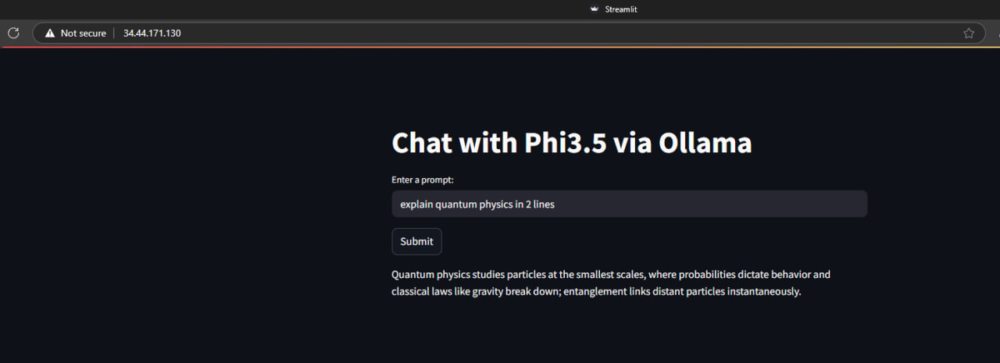

# Ollama Chatbot on GKE with Streamlit UI

This project deploys the Ollama phi3.5 language model on Google Kubernetes Engine (GKE), with a Streamlit-based frontend UI. Infrastructure is managed using Terraform, and deployed using CI/CD pipelines from GitHub Actions.

Model used: [Phi 3.5 on Ollama](https://ollama.com/library/phi3.5)

## Architecture

## Demo

Access the app here: [https://your-app-url.com](https://your-app-url.com)

## Features

- Real-time streaming responses from Ollama model
- Kubernetes deployment using Terraform automation
- Lightweight Streamlit UI for chat interaction

## Screenshots

## How to Run Locally (under construction)

1. Clone the repo

> You must enable Cloud Resource Manager API at https://cloud.google.com/resource-manager/reference/rest/