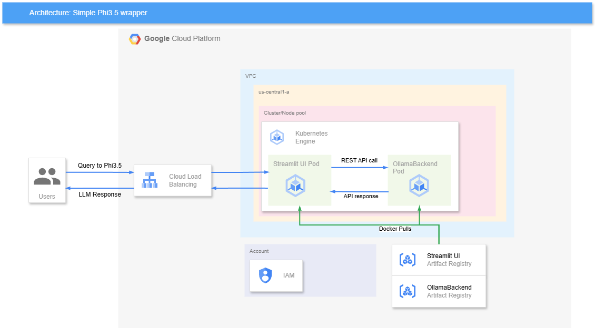
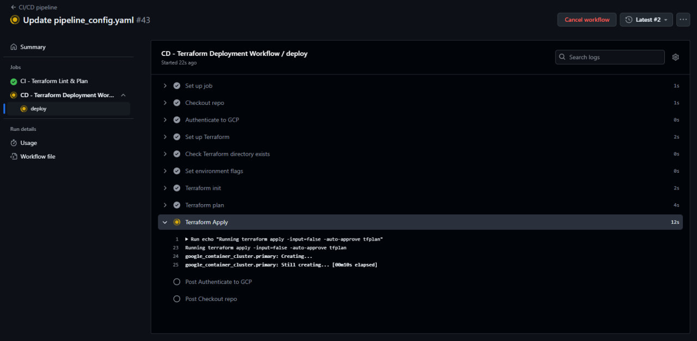
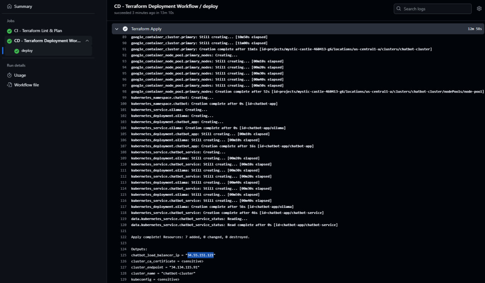
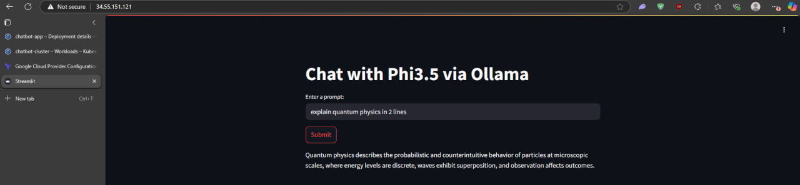
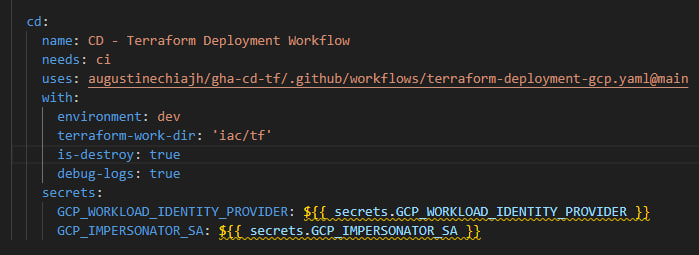
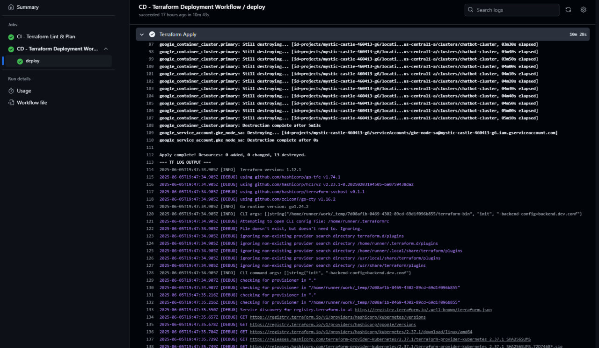
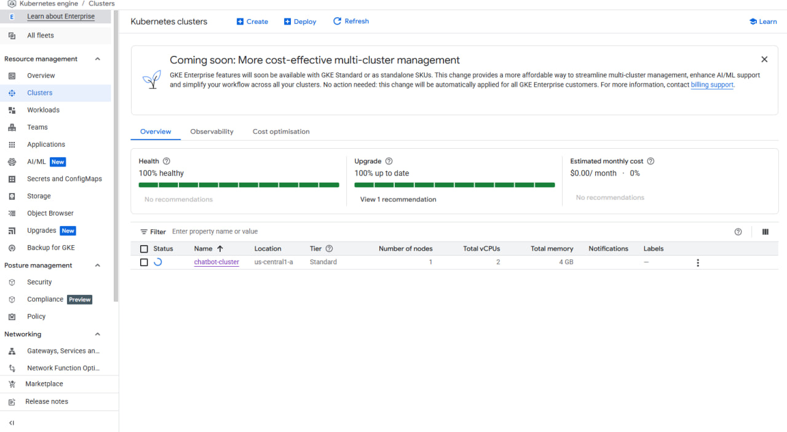
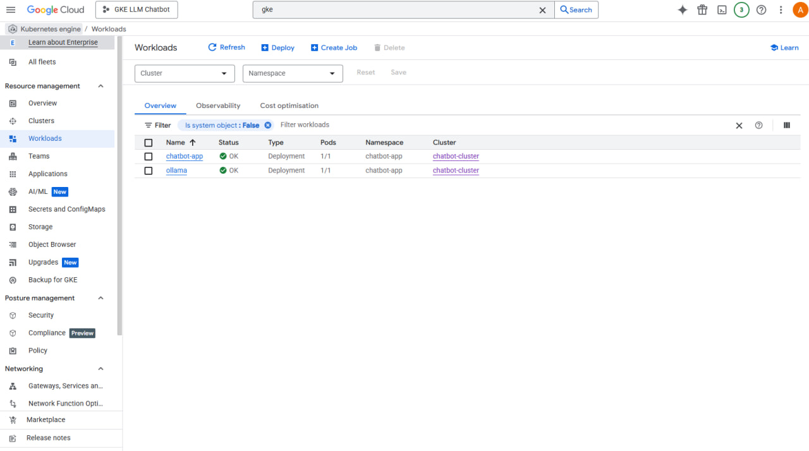

# Ollama Chatbot on GKE with Streamlit UI

This project deploys the Ollama phi3.5 language model on Google Kubernetes Engine (GKE), with a Streamlit-based frontend UI. Infrastructure is managed using Terraform, and deployed using CI/CD pipelines from GitHub Actions.

Model used: [Phi 3.5 on Ollama](https://ollama.com/library/phi3.5)

## Architecture

This shows the deployment of the infrastructure. The frontend used is a Streamlit UI, which sends REST API requests to the Ollama backend. Images are hosted on Artifact Registry, and get pulled during GKE resource creation. Currently since this is a lightweight POC, the cluster and node pools are only deployed to a single zone, us-central1-a in the default VPC. 

IAM follows least privileged principles, the bare minimum to provision the current infrastructure. 

## Areas of Improvement

### Availability & Resiliency
- **Current State**: The GKE cluster is deployed in a single zone (`us-central1-a`) with horizontal pod autoscaling currently disabled.
- **Improvement Opportunities**:
  - Enable **Horizontal Pod Autoscaling** to handle variable workloads more efficiently.
  - Transition to a regional GKE cluster (e.g. us-central1)to improve availability and mitigate the risk of zonal failures.
  - These enhancements can reduce downtime and improve fault tolerance in production environments.

### Networking & Security
- **Current State**: The infrastructure is deployed in the default VPC, which lacks fine-grained control over traffic flow and isolation.
- **Improvement Opportunities**:
  - Migrate to a custom VPC to define more secure ingress and egress rules, subnets, and firewall configurations.
  - Consider using private clusters and internal load balancers for services not exposed to the internet.
  - Introduce API Gateway for logging and rate limiting, controlling LLM usage and network attacks.

### LLM Enhancements
- **Current State**: The Ollama-hosted `phi3.5` model is used out-of-the-box with no context injection (RAG), prompt control, or hallucination mitigation.
- **Improvement Opportunities**:
  - Integrate LangChain to enable memory, prompt templates, and context handling.
  - Add Retrieval-Augmented Generation (RAG) pipelines using a lightweight vector database to ground the model’s output in factual data.
  - Introduce guardrails or response validation layers to reduce hallucinations and enforce output structure.

### Automation
- **Current State**: Even though provisioning of the infra is automated, using reusable GHA workflows and actions, pushing images to Artifact Repository is still not automated. There are still many steps involved in setting up the user's GitHub repo as well
- **Improvement Opportunities**:
  - Include docker build and pushes as part of the GitHub Actions pipeline_config.yaml
  - Convert this repository into a GitHub template repo, allowing users to easily generate their own copies.
  - Provide bootstrap scripts (`setup.sh` or `bootstrap.py`) that prompt for inputs like `PROJECT_ID`, `REGION`, and other environment variables, and automatically apply them across the necessary files (Terraform, workflows, etc.).
  - Automate the initialization of required secrets, Terraform state configuration, or service accounts if applicable.

## Features

- **Response streaming** from Ollama-hosted Phi3.5 LLM.
- **Automated Kubernetes Deployment**: Infrastructure is provisioned and deployed to GKE using Terraform and GitHub Actions. 
- **Reusable CI/CD Components**:
  - [`gha-ci-tf`](https://github.com/augustinechiajh/gha-ci-tf): Reusable CI workflow for Terraform validate and tflinting.
  - [`gha-cd-tf`](https://github.com/augustinechiajh/gha-cd-tf): Reusable CD workflow for Terraform apply/destroy logic.
- **Custom Docker Image**: GitHub-hosted Docker image (GHCR) with preinstalled Terraform tools for linting and validation, improving consistency and speed in CI workflows.[`ghcr.io/augustinechiajh/terraform-tools:latest`](https://ghcr.io/augustinechiajh/terraform-tools).
- **Minimalist Chat UI**: Lightweight Streamlit-based frontend for chatting with the LLM.

## Screenshots
Below are some sample screenshots during the provisioning, and destroying process of the infrastructure using GHA.

### 1. Provisioning (GitHub Actions)
Below is a screenshot of the GitHub Actions workflow successfully provisioning the GCP infrastructure using Terraform.

### 2. Destroying (GitHub Actions)
This screenshot shows the teardown process initiated from GitHub Actions, including how to configure terraform destroy and log debugging from the reusable CD workflow

### 3. GKE Cluster on Google Cloud Console (Optional)
Screenshot of the deployed GKE cluster and workloads visible on the Cloud Console dashboard.

## How to Run Locally (under construction)

### Prerequisites
Ensure you have:
- A GCP project ID
- Permissions to create IAM roles and Workload Identity Pools
- Terraform installed
- GitHub account

### Steps
1. Create a new repo using this repo as a template
This will give you a clean Git history, full ownership, and ability to deploy to your own dev and prod environments.

2. Ensure that you are in the correct GCP project and have owner or admin roles. (authenticate using gcloud auth CLI command)

Note: You must enable the following APIs as Google disables them by default:
- Cloud Resource Manager API at https://cloud.google.com/resource-manager/reference/rest/ 

3. Go to iac/prerequisites, edit the terraform.dev.tfvars file to match your project ID and Github Repo name, then run terraform init, plan and apply.
This creates an OIDC service account, and a deployment service account which will be used to provision the GKE cluster, node pools and other supporting infra.
Note down the outputs of the Terraform apply, as that will be your environment secrets for running the GHA pipeline. 

Under your GitHub repo settings, go to Secrets and variables, Actions, and create the following repo secrets:
- GCP_WORKLOAD_IDENTITY_PROVIDER: OIDC authentication for your GitHub repo to use to provision resources in GCP
- GCP_IMPERSONATOR_SA: this is the OIDC service account your repo will be using

4. In your GitHub repo, create an environment, e.g. dev. It is optional to configure protection rules as required.

5. Build and push docker images to your Google Artifactory Repository
There are 2 docker images, located in the /app folder. They are Dockerfile.chatbot, which hosts the image for Streamlit UI, and Dockerfile.ollama, which we will be using Phi3.5, a lightweight LLM that can run without GPU as our local LLM.

Note down the location paths of where you stored the artifacts in Artifactory Repository, and update iac/tf/terraform.dev.tfvars accordingly.

6. Once you have made all the changes, commit and push them, which will trigger the GitHub repo. CI and CD pipeline are from reusable workflows or actions that are public, so it should not create any permission issues.

7. To verify successful deployment, go to the GitHub Action workflow run, and view the CD Job under deploy. Go to the Terraform Apply step, and note the Outputs: chatbot_load_balancer_ip = "<ip address>" 

This IP address will allow you to access the Streamlit frontend to start querying the Phi3.5 model. 

8. To destroy infra, go to .github/workflows/pipeline_config.yaml, and in the CD workflow, set is-destroy to true.